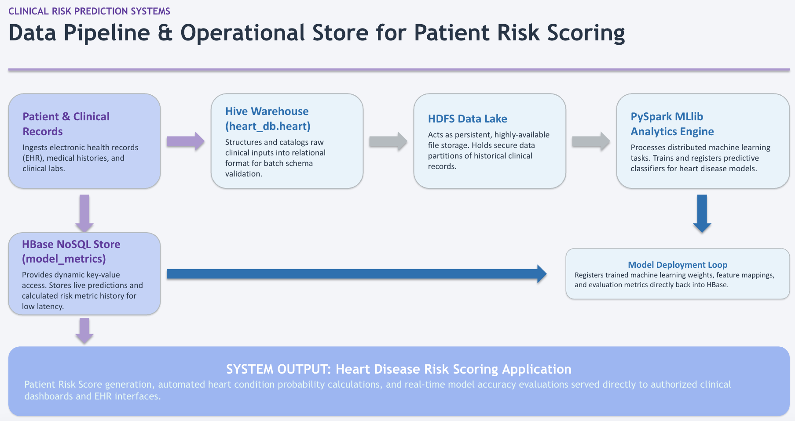

# Architecture

The project architecture follows an end-to-end big data processing pipeline:

**Source Data → Apache NiFi → HDFS → Apache Hive → Apache Spark MLlib → Apache HBase**

Spark workloads are submitted and managed through YARN. The high-level system architecture illustrates the distributed components and execution flow across the cluster. Component directories contain the implementation code, written explanations, and execution evidence for each stage.

---

## High-Level System Architecture

---

## Data Flow & Pipeline Stages

### Pipeline Component Breakdown

* **Source Data & Ingestion (Apache NiFi):** Ingests raw patient clinical records, performs routing, and delivers files directly to distributed HDFS storage.
* **Storage & Warehouse Layer (HDFS & Apache Hive):** 
  * **HDFS:** Serves as the distributed data lake for raw and processed file persistence.
  * **Apache Hive:** Manages structured schema storage (`heart_db.heart_disease`) over HDFS data, allowing SQL analytics and seamless metastore integration with Spark.
* **Compute & Resource Management (YARN):** Allocates cluster resources across master and worker nodes for distributed job execution.
* **Analytics & Machine Learning (Apache Spark MLlib):** Executed via `spark-submit` on YARN. Reads from Hive, applies feature engineering pipelines (vector assembly, standard scaling), trains binary classification models, and evaluates prediction metrics.
* **Operational NoSQL Persistence (Apache HBase):** Persists both aggregate run performance metrics (`metrics` column family) and row-level patient risk predictions (`predictions` column family) via the HBase Thrift API over `master:9090`.