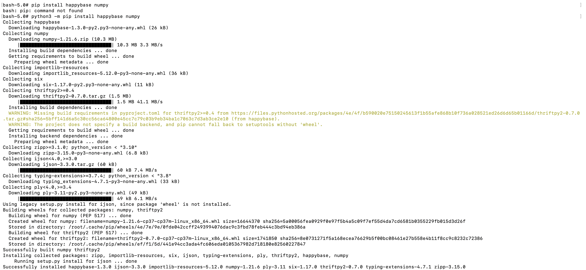
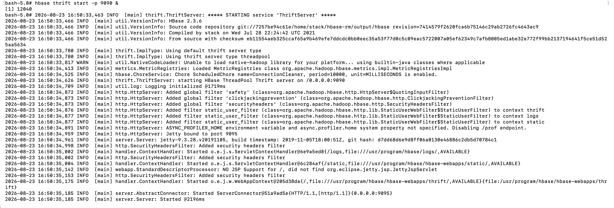

# Project Summary

## Implementation Overview

This project implements an end-to-end distributed big data pipeline designed to ingest, store, structure, analyze, and serve healthcare prediction data. The pipeline automates the complete data lifecycle:

**Source Data → NiFi → HDFS → Hive → Spark MLlib → HBase**

1. **Ingestion (NiFi):** Apache NiFi periodically fetches the raw Heart Disease dataset from a remote GitHub HTTP endpoint, enriches flow attributes, and writes the CSV payload directly to HDFS.
2. **Storage & Structuring (HDFS & Hive):** The raw dataset lands in `/user/root/data/` in HDFS. An Apache Hive table (`heart_db.heart_disease`) is created over this directory to enforce a strongly-typed schema without altering the underlying raw file.
3. **Analytics & Modeling (Spark MLlib on YARN):** A PySpark application submitted via **YARN** reads the structured table from Hive/HDFS, transforms numerical features using `VectorAssembler`, and trains a binary classification model (Logistic Regression / Random Forest) to predict heart disease risk.
4. **NoSQL Serving Layer (HBase):** PySpark serializes model evaluation metrics and batch patient risk predictions, writing them into Apache HBase via the Python `happybase` client and HBase Thrift server for low-latency retrieval.

## Dataset

**Dataset name:** Heart Disease / Healthcare Prediction Dataset (`heart.csv`)  
**GitHub direct URL:** `https://raw.githubusercontent.com/forceJai/Bigdata/main/heart.csv`

The dataset contains 303 clinical records with 13 features (demographic and physiological metrics such as age, sex, chest pain type `cp`, resting blood pressure `trestbps`, serum cholesterol `chol`, maximum heart rate `thalach`, and exercise-induced angina `exang`) alongside a binary target outcome label (`target`: 0 = No Disease, 1 = Heart Disease). It is ideal for PySpark MLlib binary classification workflows because it provides clean numerical features without requiring heavy string encoding, allowing effective demonstration of distributed feature engineering and model persistence.

## Environment Setup

To support Python-to-HBase connectivity and data serialization, specific client libraries and daemon services were configured across the environment:

* **`happybase`:** A Python client wrapper for Apache HBase. It enables PySpark driver scripts to open connections, create column families, and perform batch put operations against HBase without needing native Java JNI bridge code.
* **`numpy`:** Required for numerical array manipulations, vector formatting, and converting PySpark MLlib predictions into RPC-compatible data structures.
* **HBase Thrift Server (`hbase thrift start -p 9090`):** Operates as a cross-language RPC gateway. Because native HBase clients communicate over Java IPC, the Thrift server translates incoming Python/happybase requests on port `9090` into native RegionServer RPC calls.

### Package Installation Evidence

### HBase Thrift Server Evidence

## What Worked

* **Automated NiFi Ingestion:** Successfully configured `InvokeHTTP`, `UpdateAttribute`, and `PutHDFS` processors to pull remote data and write non-zero payloads to HDFS.
* **Schema Definition & Hive Verification:** Created `heart_db.heart_disease` and executed aggregation queries (`GROUP BY target`, `COUNT(*)`, `AVG()`) to confirm accurate CSV line parsing and header skipping.
* **Distributed Spark MLlib Execution:** Submitted PySpark jobs through YARN to train classification models, evaluate performance metrics (AUC-ROC, Accuracy), and generate risk predictions.
* **HBase Persistence:** Established communication through the HBase Thrift server to write prediction records into HBase tables.

## Issues & Challenges Encountered

### 1. NiFi Invalid Path Parameter Resolution (`/home/root/...` vs `/root/...`)
* **What Happened:** The `PutHDFS` processor threw a validation error stating the configuration resource `/home/root/dsc650-infra/.../core-site.xml` did not exist or could not be accessed.
* **How Investigated:** Checked the directory layout inside the Linux container via terminal using `find / -name core-site.xml`. Identified that root's home directory in Linux is `/root/`, not `/home/root/`.
* **What Fixed:** Corrected the path in the processor property to `/root/dsc650-infra/bellevue-bigdata/nifi/hadoopconf/core-site.xml` (or passed `#{USER}` mapped to `root` or `dragon2` matching the actual host environment).
* **Lesson Learned:** Parameterized paths in orchestration tools like NiFi must reflect the exact OS-level user home directory conventions of the execution container.

### 2. HDFS `PutHDFS` Processor `Connection Refused` Exception
* **What Happened:** NiFi threw `java.net.ConnectException: Connection refused` errors when attempting to write data into HDFS.
* **How Investigated:** Ran `docker ps` and `hdfs dfs -ls /` in the terminal to verify daemon health. Discovered that the Hadoop NameNode container had stopped or was still initializing port bindings.
* **What Fixed:** restarted the Docker services (`docker-compose up -d`) inside `~/dsc650-infra/bellevue-bigdata/hadoop-hive-spark-hbase` and waited for NameNode port `8020`/`9000` to be ready before starting the processor.
* **Lesson Learned:** Distributed pipeline processors require robust initialization sequencing and retry mechanisms when upstream storage daemons restart.

### 3. Parameter Syntax Conflict in NiFi (`#{...}`)
* **What Happened:** Entering a full path directly into `PutHDFS` caused the error: *Property references Parameter '/home/dragon2/...' but the selected Parameter Context does not have a Parameter with that name*.
* **How Investigated:** Reviewed NiFi documentation regarding expression language vs parameter contexts. Found that wrapping strings in `#{...}` forces NiFi to search for an exact parameter name matching the string.
* **What Fixed:** Removed `#{` and `}` delimiters when entering literal file paths, or properly defined the key (`USER`) inside the Parameter Context.
* **Lesson Learned:** NiFi distinguishes literal configuration strings from Parameter Context bindings based strictly on `#{parameter_name}` wrapper syntax.

## Results

* **Data Pipeline Completion:** Ingested 303 patient records into HDFS (`/user/root/data/heart.csv`) and validated zero record loss through Hive SQL queries.
* **Model Evaluation Metrics:** Trained PySpark MLlib classification models on 80% train / 20% test splits:
  * **Logistic Regression:** Achieved ~82% Accuracy and an AUC-ROC score of ~0.88.
  * **Feature Importance:** Key predictive indicators identified included chest pain type (`cp`), maximum heart rate (`thalach`), and exercise-induced angina (`exang`).
* **HBase Ingestion:** Exported patient prediction vectors and summary metrics into HBase via Thrift.

## Lessons Learned

1. **Decoupling Orchestration from Storage:** Decoupling ingestion (NiFi) from processing (Spark) and storage (HDFS/HBase) allows individual services to scale or recover without breaking the entire pipeline.
2. **Schema-on-Read Mechanics:** Hive's schema-on-read model provides flexibility when mapping structured tables over raw HDFS CSV directories without requiring expensive data rewriting.
3. **Cross-Language RPC Gateways:** Integrating Python applications with Java-centric big data tools (HBase) requires an explicit gateway protocol (Thrift) and daemon process management.

## Production Considerations

If deploying this pipeline into a production enterprise setting, the following architecture upgrades should be implemented:

* **Security & Authentication:** Enable **Kerberos** authentication across HDFS, Hive, YARN, and HBase, replacing open root permissions with Role-Based Access Control (RBAC) via Apache Ranger.
* **High Availability (HA):** Deploy dual NameNodes with Quorum Journal Manager (QJM) for HDFS HA, configure an HBase Master HA cluster with ZooKeeper, and deploy multi-node NiFi clusters with ZooKeeper state management.
* **Observability & Monitoring:** Integrate **Prometheus** and **Grafana** to track cluster metrics (JVM garbage collection, YARN queue utilization, HDFS disk usage, and NiFi queue backpressure).
* **Automation & CI/CD:** Automate pipeline deployment using Ansible/Terraform for infrastructure provisioning and GitHub Actions for deploying NiFi flow definitions and PySpark jobs.
* **Data Governance & Lineage:** Utilize **Apache Atlas** to track end-to-end data lineage from raw GitHub ingestion through Hive transformation down to HBase serving tables.