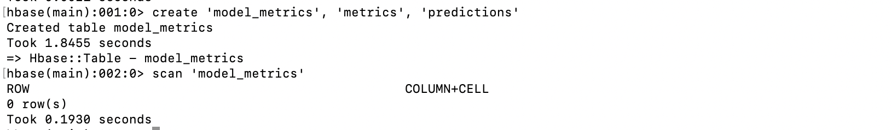
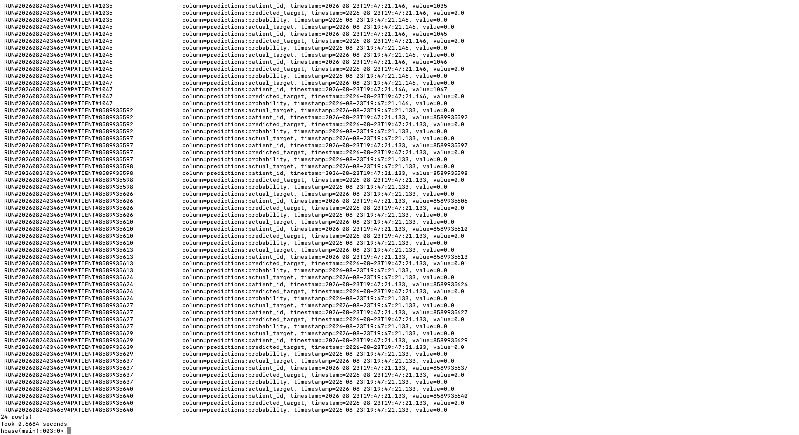
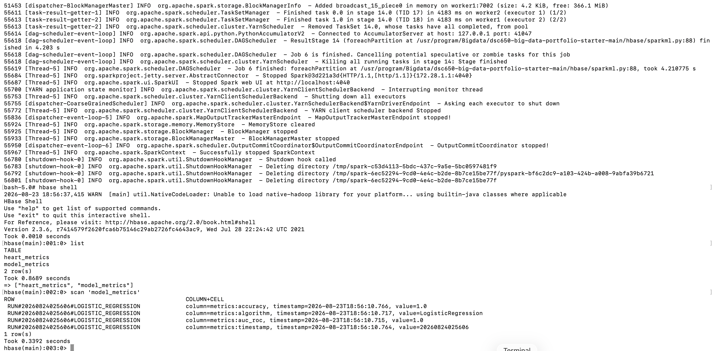

# HBase Schema & Design Documentation

## Table Overview

* **Table Name:** `model_metrics`
* **Column Families:** `metrics`, `predictions`
* **Access Protocol:** Apache HBase Thrift API (port `9090`)

## Column Family Design

### 1. `metrics` Column Family
* **Purpose:** Stores aggregate execution and evaluation metrics generated by PySpark MLlib model training jobs.
* **Column Qualifiers:** `metrics:auc_roc`, `metrics:accuracy`, `metrics:precision`, `metrics:recall`, `metrics:algorithm`, `metrics:timestamp`
* **Rationale:** Isolating high-level execution performance indicators into a dedicated column family allows downstream analytical tools and monitoring scripts to scan overall model performance across runs without loading dense row-level predictions into memory.

### 2. `predictions` Column Family
* **Purpose:** Stores individual patient-level classification outcomes, ground-truth labels, and predicted risk probabilities.
* **Column Qualifiers:** `predictions:patient_id`, `predictions:actual_target`, `predictions:predicted_target`, `predictions:probability`
* **Rationale:** Grouping row-level inferencing results separately allows clinical serving layer endpoints to query specific patient risk scores without fetching aggregate training metadata.

---

## Row Key Design Strategy

To support storing both run summaries and detailed predictions within the same table, two complementary row key formats are used:

### 1. Run Summary Row Key
* **Format:** `RUN#<TIMESTAMP>#<ALGORITHM>` (e.g., `RUN#20260823120000#LOGISTIC_REGRESSION`)
* **Rationale:** 
  * HBase stores data in lexicographical order. Prefixing row keys with an execution timestamp ensures training runs are organized chronologically.
  * Including the algorithm name avoids key collisions when multiple model variants are evaluated within the same job execution window.
  * Enables efficient range scans to retrieve latest model evaluation metrics without scanning entire patient sets.

### 2. Prediction Record Row Key
* **Format:** `RUN#<TIMESTAMP>#PATIENT#<PATIENT_ID>` (e.g., `RUN#20260823120000#PATIENT#10482`)
* **Rationale:**
  * Binds patient inferencing results directly to the associated model run timestamp.
  * Guarantees unique row keys while enabling fast point lookups (`GET`) for individual patient risk scores.

---

## Table Verification & Screenshots

### Pre-Execution State
Prior to executing the PySpark machine learning pipeline, a scan of the `model_metrics` table confirms that the schema exists in HBase without stale or leftover records:



### Post-Execution State
Following job completion, HBase scans verify that both aggregate performance metrics and individual patient predictions were persisted successfully across their respective column families:





---

## Infrastructure & PySpark Integration

### Distributed Worker Connection Setup
When writing to HBase from PySpark using `happybase` across partitions (e.g., via `foreachPartition` in `analysis.py`), tasks execute on distributed YARN executor nodes (`worker1`, `worker2`).

* **Host Binding:** `happybase.Connection()` must **not** be set to `'localhost'`. When executed inside a Spark worker container, `'localhost'` attempts to connect to the worker node itself, causing a `ConnectionRefusedError [Errno 111]` on port 9090.
* **Target Configuration:** Expressly target the master host running the Thrift daemon (`master` or container IP):

```python
def write_predictions_to_hbase(partition):
    """
    Executes inside each Spark worker partition to stream prediction records to HBase.
    """
    import happybase

    # Connect to the HBase Thrift service running on the master node
    connection = happybase.Connection('master', port=9090)
    connection.open()
    table = connection.table('model_metrics')
    
    # Use batch mutation for performant distributed writes
    with table.batch(batch_size=500) as batch:
        for row in partition:
            row_key = f"RUN#{row.timestamp}#PATIENT#{row.patient_id}".encode('utf-8')
            batch.put(row_key, {
                b'predictions:patient_id': str(row.patient_id).encode('utf-8'),
                b'predictions:actual_target': str(row.label).encode('utf-8'),
                b'predictions:predicted_target': str(row.prediction).encode('utf-8'),
                b'predictions:probability': str(row.probability).encode('utf-8')
            })
            
    connection.close()