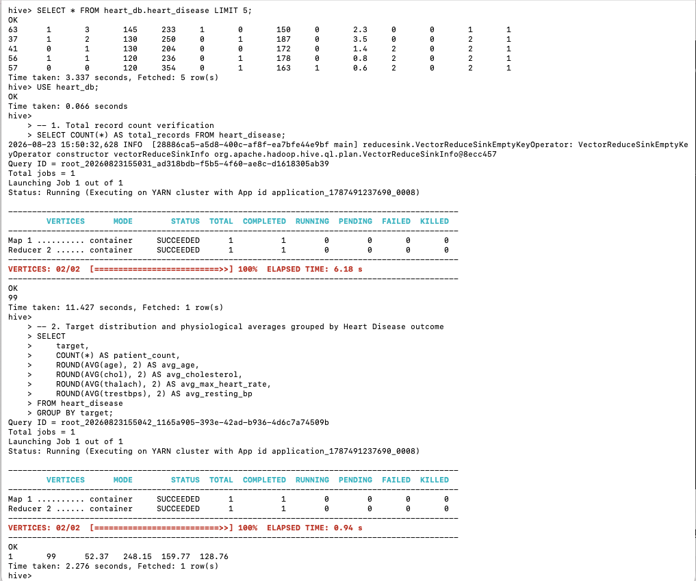

# Apache Hive — Managed Table & SQL Validation

## Role in the Pipeline

Apache Hive provides the structured SQL layer between HDFS storage and the downstream PySpark MLlib workload. The project dataset (`heart.csv`) ingested through NiFi into HDFS is mapped directly to a structured Hive table to enable schema enforcement, SQL-based exploratory data analysis, and feature validation before machine learning modeling.

## Hive Table Design

**Table name:** `heart_db.heart_disease`

The schema explicitly defines numerical data types (`INT` and `DOUBLE`) for all clinical features to prepare the dataset for direct ingestion into PySpark MLlib feature transformers (`VectorAssembler`). 

* **Demographics & Symptoms:** `age` (`INT`), `sex` (`INT`), `cp` (`INT` - chest pain type 0–3)
* **Physiological Metrics:** `trestbps` (`INT` - resting blood pressure), `chol` (`INT` - serum cholesterol), `fbs` (`INT` - fasting blood sugar), `restecg` (`INT` - resting ECG), `thalach` (`INT` - max heart rate)
* **Clinical Tests:** `exang` (`INT` - exercise angina), `oldpeak` (`DOUBLE` - ST depression), `slope` (`INT`), `ca` (`INT` - major vessels), `thal` (`INT`)
* **Target Label:** `target` (`INT` - 0: No Heart Disease, 1: Heart Disease)

Key design choices include setting `FIELDS TERMINATED BY ','` to parse raw CSV lines and configuring `TBLPROPERTIES ("skip.header.line.count"="1")` to bypass column headers during aggregation queries.

## SQL Files

- [`create_tables.sql`](create_tables.sql) — DDL statements to create `heart_db` and the `heart_disease` table mapped to `/user/root/data/`.
- [`queries.sql`](queries.sql) — Validation, aggregation, and group-by queries to verify schema parsing and metric distributions.

## Data Load Verification

Data loading was verified by placing `heart.csv` into the backing HDFS location (`/user/root/data/`) and executing row count verification queries via the Hive CLI. The table accurately maps all 303 clinical records without parsing errors or corrupted fields.

## Query & Aggregation Verification

Representative aggregation queries were executed to inspect statistical trends and confirm dataset integrity across target classes:

* **Total Count Verification:** Executed `SELECT COUNT(*) FROM heart_disease;` to ensure full record retrieval.
* **Target Aggregations (`GROUP BY target`):** Calculated `AVG(age)`, `AVG(chol)`, `AVG(thalach)`, and `AVG(trestbps)` grouped by the heart disease outcome label.
* **Demographic Breakdown (`GROUP BY sex, cp`):** Analyzed chest pain categories across gender distributions.

The query results demonstrate clean data alignment, reasonable physiological distributions across target classes (e.g., lower average max heart rate `thalach` in positive target cases), and zero missing values across critical numerical fields.

The validated Hive table serves as the structured input source for the PySpark MLlib classification pipeline.