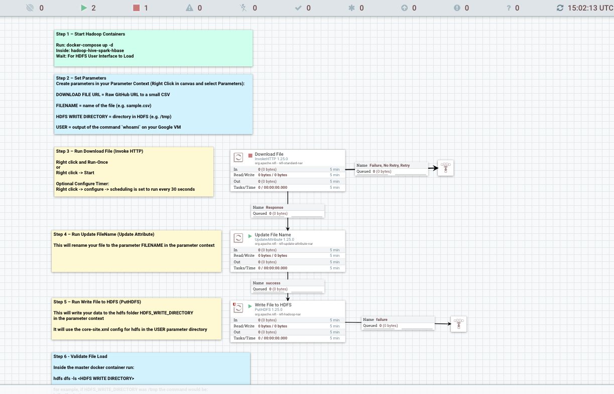
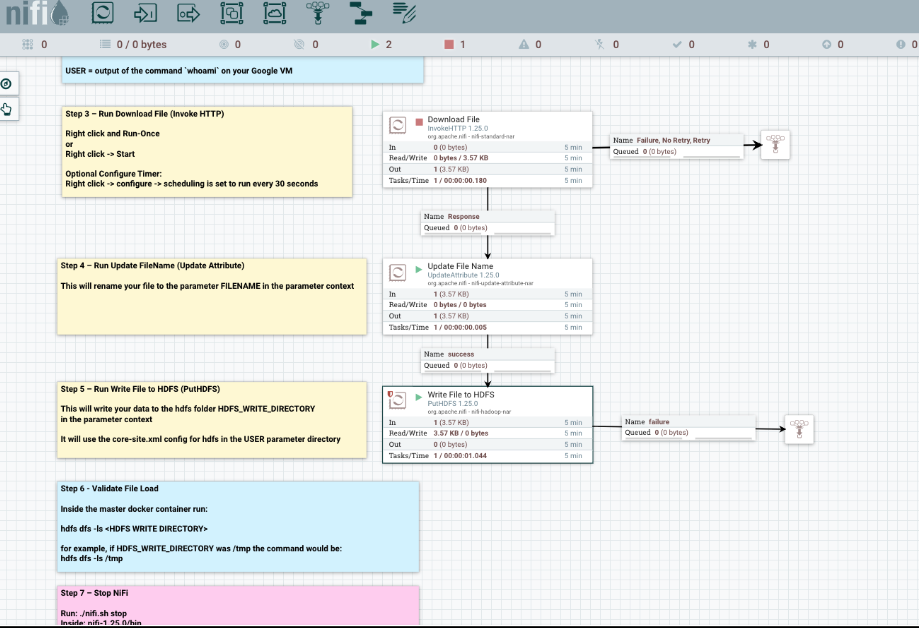
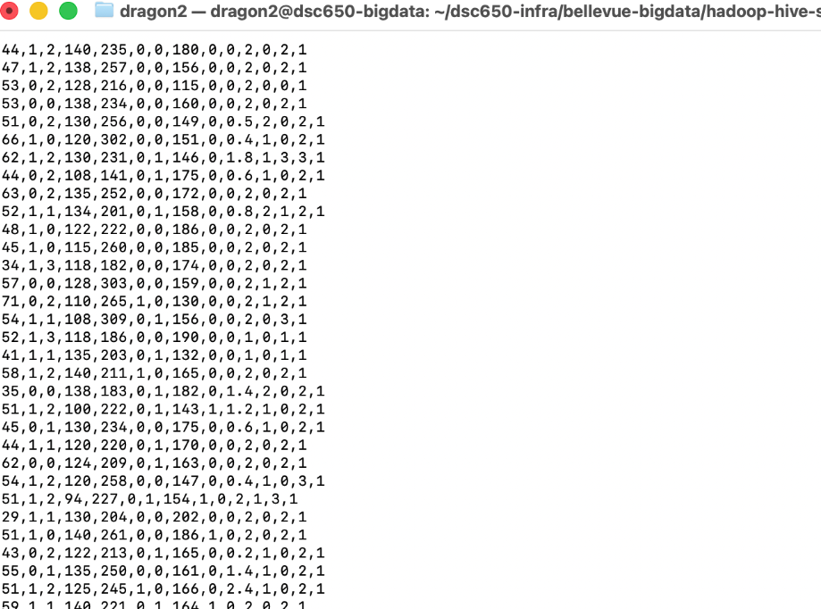

# Apache NiFi — Data Ingestion into HDFS

## Role in the Pipeline

Apache NiFi provides the automated data ingestion and orchestration layer for this project. The flow retrieves the raw dataset directly from GitHub via HTTP and persists it into HDFS for downstream processing by Hive and Apache Spark MLlib.

## Source Dataset

**Dataset:** Heart Disease / Healthcare Prediction Dataset (`heart.csv`)  
**GitHub direct URL:** `https://raw.githubusercontent.com/forceJai/Bigdata/main/heart.csv`

This dataset contains clinical patient features including demographic attributes (age, sex) and key physiological metrics (chest pain type, resting blood pressure, serum cholesterol, fasting blood sugar, resting ECG, maximum heart rate, exercise-induced angina, and ST depression). The primary target variable is binary (`target`: 0 = No Heart Disease, 1 = Heart Disease). It was selected because it provides a realistic, structured healthcare scenario suitable for binary classification modeling using PySpark MLlib without causing memory overhead or resource strain on the infrastructure.

## Flow Design

| Processor / Process Group | Role in the Flow |
|---|---|
| **InvokeHTTP** (*Download File*) | Executes an HTTP GET request to pull the raw `heart.csv` file from the remote GitHub URL on a scheduled interval. |
| **UpdateAttribute** (*Update File Name*) | Enriches FlowFile metadata by setting an explicit output filename (`filename = heart.csv`). |
| **PutHDFS** (*Write File to HDFS*) | Streams the FlowFile payload directly into Hadoop Distributed File System (HDFS) using the cluster's `core-site.xml` configuration. |

### Data Flow Lifecycle
1. **Data Ingestion:** The `InvokeHTTP` processor fetches the dataset from GitHub and creates an initial FlowFile containing the CSV payload.
2. **Attribute Transformation:** The FlowFile passes to `UpdateAttribute`, which attaches target naming metadata to ensure consistency in storage.
3. **HDFS Persistence:** The `PutHDFS` processor receives the FlowFile, resolves the Hadoop cluster NameNode connection, and writes the contents directly to the target HDFS directory.

## HDFS Destination

**HDFS path:** `/tmp/`

NiFi writes the dataset into `/tmp/heart.csv` in distributed storage. This directory serves as the landing location for Stage 2 of the pipeline, where Apache Hive external tables are defined over the raw CSV file to enable structured SQL querying, schema enforcement, and feature extraction for PySpark.

## Execution Evidence

### Final NiFi Flow

### Running Flow / Queue Activity

### HDFS Ingestion Verification

The HDFS verification screenshot confirms successful execution using `hdfs dfs -ls /user/root/data/`, verifying that `heart.csv` is stored in HDFS distributed storage with a non-zero byte size.