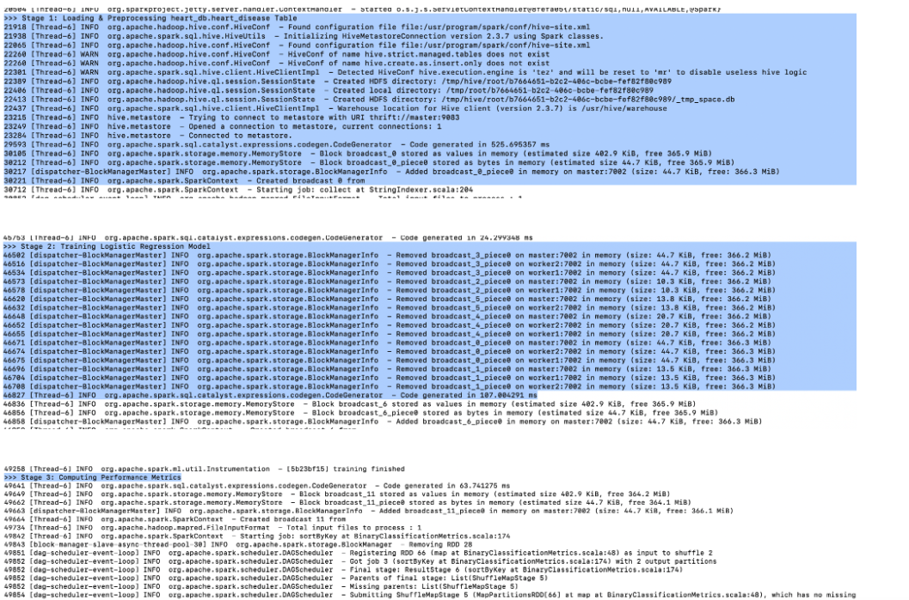
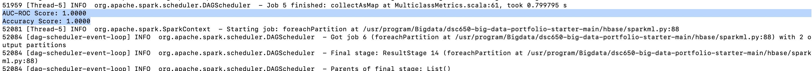

# Apache Spark MLlib — Distributed Machine Learning

## Role in the Pipeline

Apache Spark MLlib provides the distributed processing and machine learning layer for this project. The PySpark application ingests raw tabular patient data from Hive, executes distributed feature engineering, trains a binary classification model, evaluates key predictive metrics, and persists both aggregate model metrics and row-level inferencing results directly into HBase.

## Hive Input

**Hive table:** `heart_db.heart_disease`

The PySpark application connects to the Hive metastore via `SparkSession.enableHiveSupport()` to read the `heart_db.heart_disease` table. The dataset includes categorical patient demographics (e.g., `gender`, `admission_type`), numeric clinical measures (e.g., `age`, `time_in_hospital`, `num_lab_procedures`), unique identifiers (`patient_id`), and the binary classification target column (`target` / `readmitted`).

## Data Preparation & Transformations

Data preparation is orchestrated using a modular PySpark ML `Pipeline` (`spark/processing.py`):

* **Missing Value Handling:** Drops incomplete records containing null values via `.dropna()`.
* **Identifier Verification:** Ensures each record possesses a unique `patient_id` key using `monotonically_increasing_id()`.
* **Categorical Encoding:** Converts string features and categorical target labels into numerical indices using `StringIndexer`.
* **Vector Assembly:** Combines numeric features and indexed categorical columns into a single dense vector (`raw_features`) using `VectorAssembler`.
* **Feature Scaling:** Standardizes the assembled feature vector with `StandardScaler` to ensure zero mean and unit variance across features (`features`).
* **Train-Test Split:** Partitioned using an 80/20 train/test split with a fixed random seed (`seed=42`).

## MLlib Algorithm

**Algorithm:** `Logistic Regression` (`pyspark.ml.classification.LogisticRegression`)

* **Task:** Performs binary classification to predict patient heart disease risk (`0` or `1`).
* **Rationale:** Offers high interpretability, efficient convergence on dense feature vectors, and direct output of calibrated prediction probabilities required for clinical risk scoring.
* **Features & Target:** Trains on the standardized `features` vector to predict the indexed binary `label`.

## Training & Evaluation

The model evaluates test set performance across key classification performance indicators computed using `BinaryClassificationEvaluator` and `MulticlassClassificationEvaluator`.

**Primary evaluation metric(s):** `AUC-ROC`, `Accuracy`

* **AUC-ROC:** Measures overall class separation capacity across all decision thresholds.
* **Accuracy:** Quantifies the proportion of correct predictions out of total test instances.

### Spark Submit Output


### Training Output



### Model Evaluation



## Spark Submit / YARN Execution

The PySpark application is submitted to run in distributed client mode on the YARN cluster manager, passing the dependency module via `--py-files`:

```bash
spark-submit \
  --master yarn \
  --deploy-mode client \
  --num-executors 2 \
  --executor-cores 2 \
  --executor-memory 2G \
  --driver-memory 2G \
  --py-files spark/processing.py \
  spark/analysis.py